# RatecodeID 예측 ML 모델 결과 리포트

## 1. 모델 개요

| 항목 | 내용 |
|------|------|
| 데이터셋 | `yellow_tripdata_2026-05_ml.parquet` (3,021,962행 × 11컬럼) |
| 학습 샘플 | 500,000행 (stratified split) |
| 타겟 변수 | `RatecodeID` (6-class classification) |
| 입력 변수 | 9개 (PULocationID, DOLocationID, VendorID, payment_type, passenger_count, store_and_fwd_flag, hour, day_of_week, is_weekend) |
| 검증 방식 | 5-Fold Stratified Cross-Validation |

## 2. RatecodeID 분포

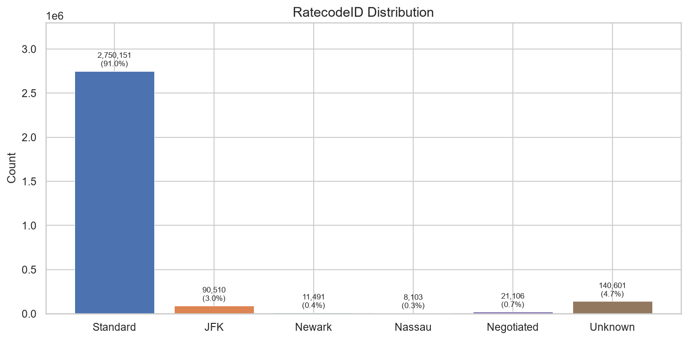

심한 클래스 불균형: Standard(91.0%), Unknown(4.7%), JFK(3.0%), Negotiated(0.7%), Newark(0.4%), Nassau(0.3%)

## 3. 변수별 EDA

### trip_distance

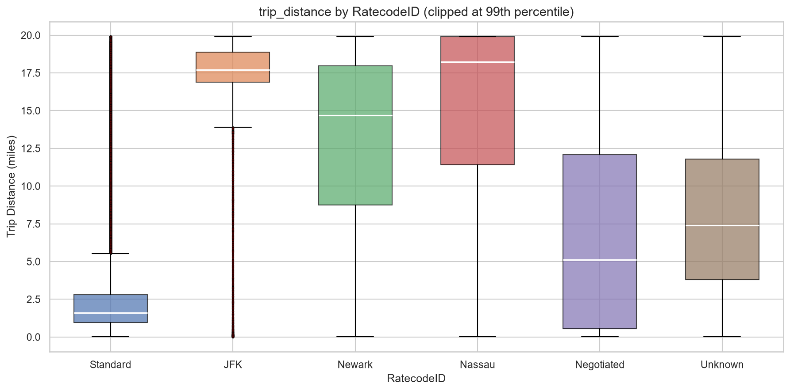
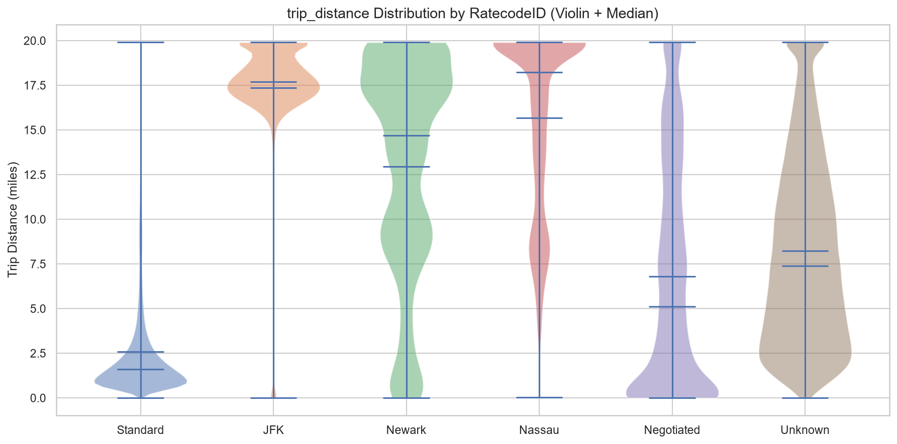

[인터랙티브 버전](figures/rc_03_trip_distance_box.html)

- JFK (17.7mi), Nassau (20.5mi)는 장거리 집중
- Standard (2.6mi)는 전형적인 시내 단거리
- Unknown (8.4mi)은 중장거리

### passenger_count

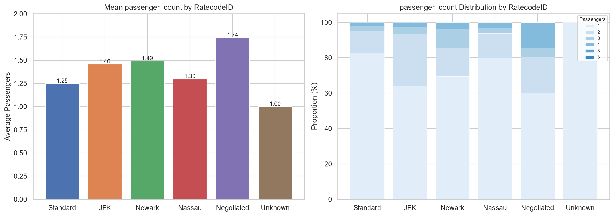

[인터랙티브 버전](figures/rc_04_passenger_count.html)

- **Negotiated** 평균 1.74명 — 유일하게 2명 이상
- **Unknown** 100% 1명 — 구조적 데이터 패턴

### Pickup Hour

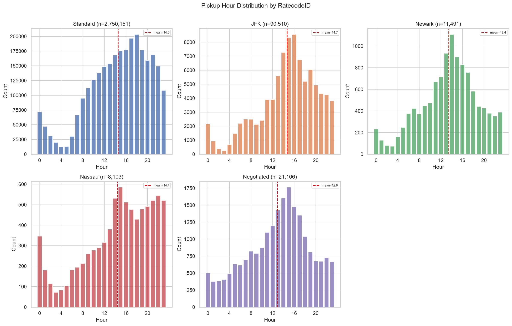

[인터랙티브 Heatmap](figures/rc_05_hour_heatmap.html)

- Unknown은 오전~정오 집중 (mean 11.9시)
- Standard 등은 오후 피크 (mean 14.5시)

### 범주형 변수

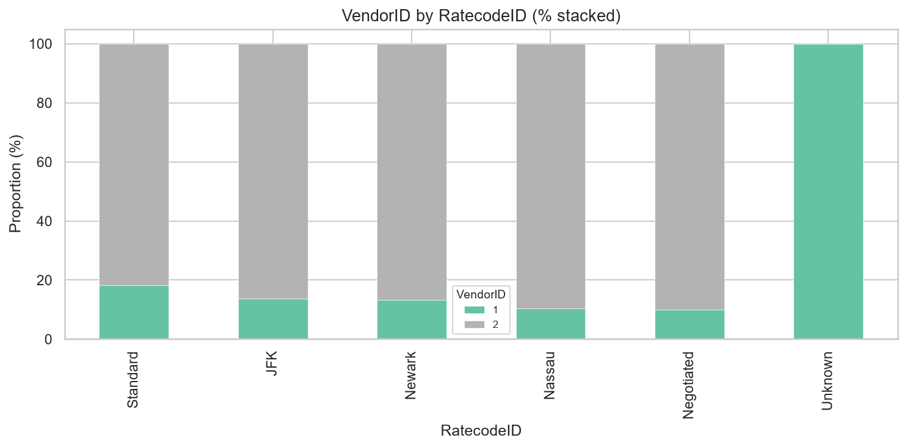
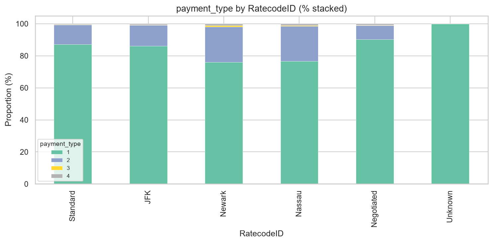
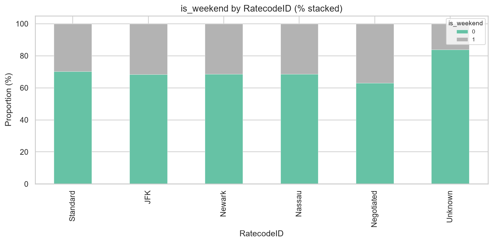

[인터랙티브 payment_type](figures/rc_07_payment_type.html)

- **Unknown**: VendorID=1 100%, payment_type=1 100%, 주말 16% — 특정 Vendor 전용 패턴

## 4. 상관관계 & 효과 크기

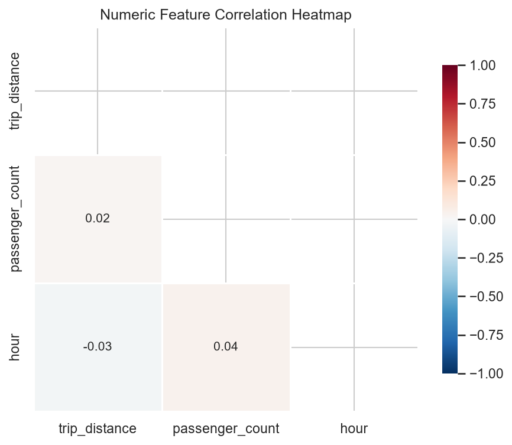
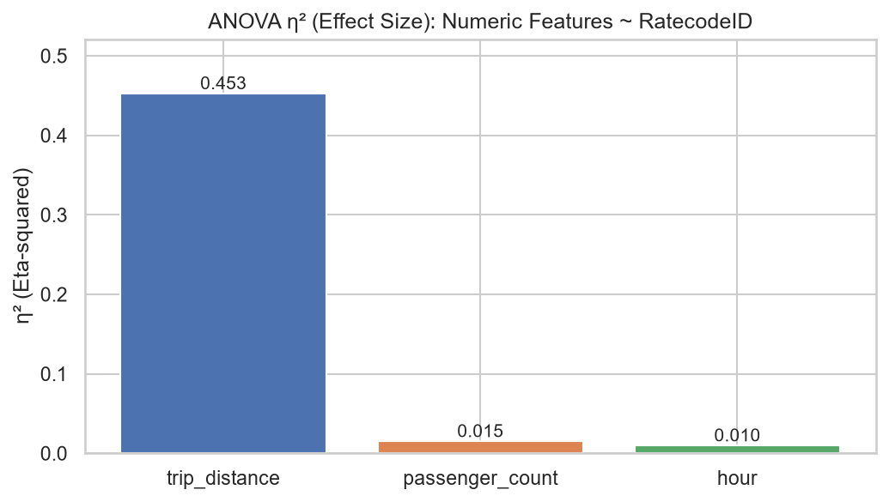

- 수치 변수 간 상관계수 최대 0.04 → 다중공선성 문제 없음
- `trip_distance`의 η²=0.45 — RatecodeID 분산의 45% 설명

## 5. t-test 결과

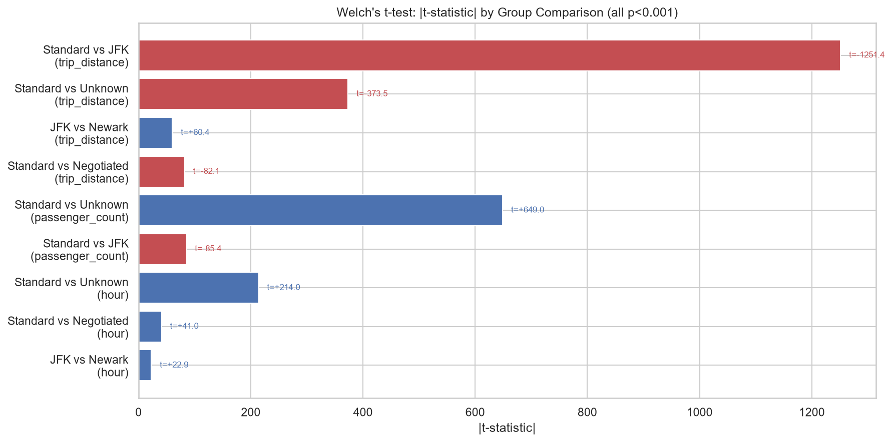

모든 그룹 비교에서 p < 0.001. 주요 비교:

| 비교 | 변수 | t-statistic | 해석 |
|------|------|:---:|------|
| Standard vs JFK | trip_distance | -1251.4 | JFK 15.1mi 더 김 |
| Standard vs Unknown | passenger_count | 649.0 | RC=99 항상 1명 |
| Standard vs Unknown | hour | 214.0 | Standard 2.6h 더 늦음 |

## 6. 모델 성능 비교

### 성능 요약

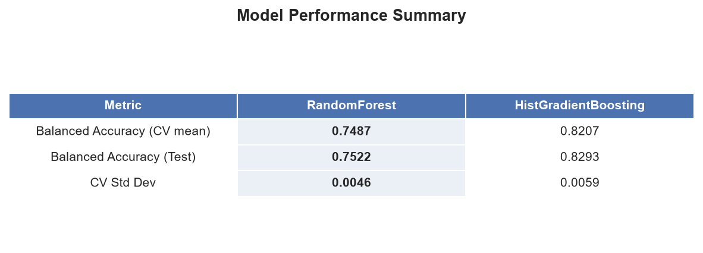

| 지표 | RandomForest | HistGradientBoosting |
|------|:---:|:---:|
| CV Balanced Accuracy | 0.7487 | **0.8207** |
| Test Balanced Accuracy | 0.7522 | **0.8293** |
| Test Macro F1 | 0.4606 | **0.5675** |
| Test Weighted F1 | 0.8042 | **0.9090** |

### CV Boxplot

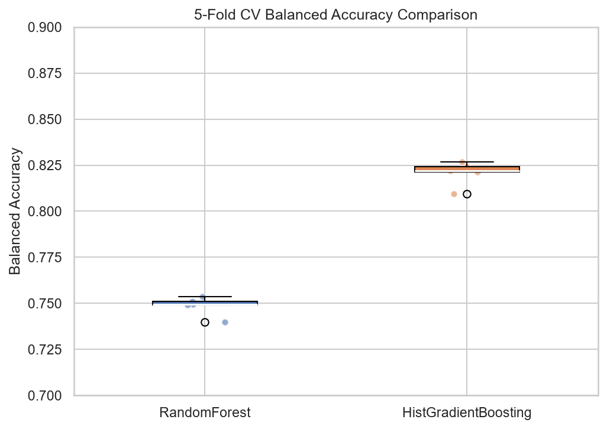

HGB가 RF보다 약 7%p 높은 balanced accuracy, CV 분산도 안정적.

### 클래스별 F1 비교

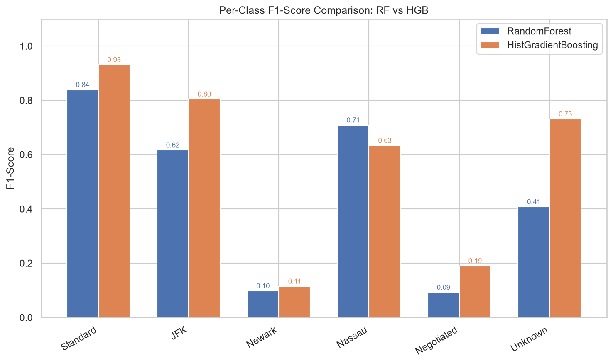

[인터랙티브 버전](figures/ml_f1_comparison.html)

| 클래스 | RF F1 | HGB F1 | 차이 |
|--------|:---:|:---:|:---:|
| Standard (91%) | 0.84 | **0.93** | +0.09 |
| JFK (3%) | 0.62 | **0.80** | +0.19 |
| Nassau (0.3%) | 0.71 | **0.63** | -0.08 |
| Unknown (4.7%) | 0.41 | **0.73** | +0.32 |
| Negotiated (0.7%) | 0.09 | **0.19** | +0.10 |
| Newark (0.4%) | 0.10 | **0.11** | +0.01 |

## 7. Confusion Matrix

### RandomForest

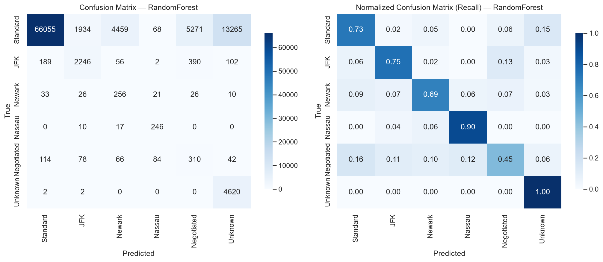

[인터랙티브 버전](figures/ml_randomforest_confusion.html)

- Standard → Standard: 72.6% (나머지 27%는 다른 클래스로 분산 예측)
- JFK → JFK: 75.2%
- Unknown → Unknown: 99.9% (거의 완벽한 recall)
- Nassau → Nassau: 90.1%
- Newark/Netotiated: recall은 높으나(69%/45%) precision은 매우 낮음(5%/5%) — 많은 거짓 양성

### HistGradientBoosting

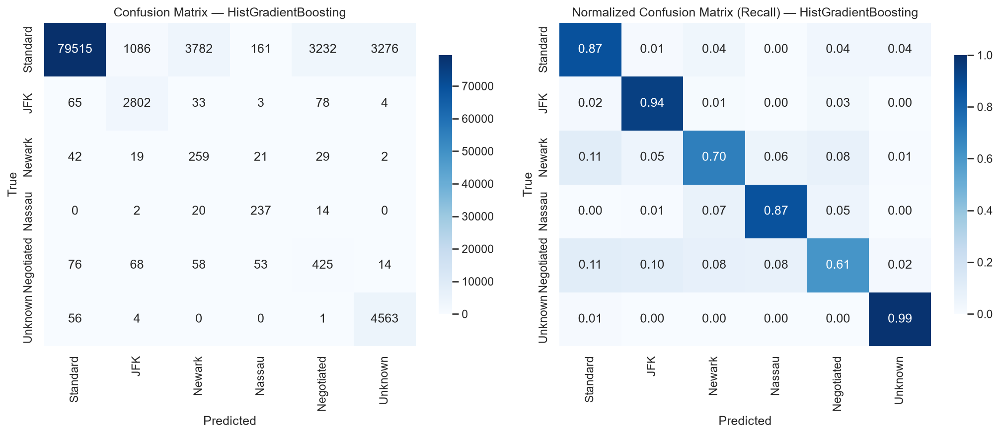

[인터랙티브 버전](figures/ml_histgradientboosting_confusion.html)

- 전반적으로 RF보다 모든 클래스에서 개선
- Standard: 87.3% (+14.8%p)
- Unknown: 98.7% 유지
- JFK: 93.9% (+18.7%p)
- Newark/Netotiated: 여전히 취약

## 8. HGB Precision/Recall/F1 Radar

[인터랙티브 Radar Chart](figures/ml_histgradientboosting_radar.html)

Standard, JFK, Unknown이 높은 성능을 보이는 반면 Newark, Negotiated는 낮은 영역에 집중

## 9. Feature Importance (RandomForest)

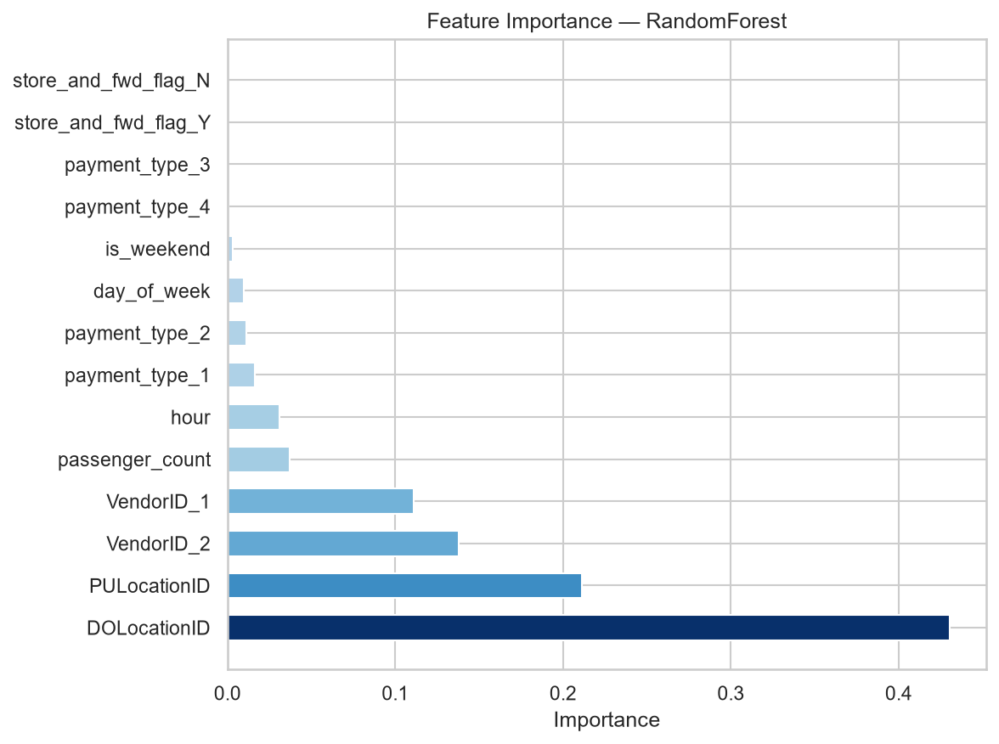

[인터랙티브 버전](figures/ml_randomforest_feature_importance.html)

| 순위 | Feature | 중요도 |
|:---:|---------|:---:|
| 1 | DOLocationID | 0.431 |
| 2 | PULocationID | 0.211 |
| 3 | VendorID_2 | 0.138 |
| 4 | VendorID_1 | 0.111 |
| 5 | passenger_count | 0.037 |
| 6 | hour | 0.031 |
| 7 | payment_type_1 | 0.016 |
| 8 | payment_type_2 | 0.011 |
| 9 | day_of_week | 0.010 |
| 10 | is_weekend | 0.003 |

> 지리 정보(DOLocationID + PULocationID)가 64%, VendorID가 25%를 차지 — 상위 4개 feature만으로 89%의 중요도

## 10. 결론 및 개선 방향

1. **HistGradientBoosting**이 RandomForest 대비 모든 지표에서 우수 (Weighted F1 0.91)
2. 주요 클래스(Standard, JFK, Unknown)는 F1 0.73~0.93으로 실무 활용 가능
3. 소수 클래스(Newark, Negotiated, support <700)는 데이터 부족으로 성능 저조 → SMOTE 오버샘플링, 데이터 추가 수집 필요
4. 지리 정보가 예측의 핵심 — 향후 위도/경도 좌표 매핑으로 정밀도 향상 가능
5. 전처리→학습→저장까지 단일 `Pipeline` 객체로 관리되어 재현성 확보

### 저장된 모델

- `output/model_rf.joblib`
- `output/model_hgb.joblib`
